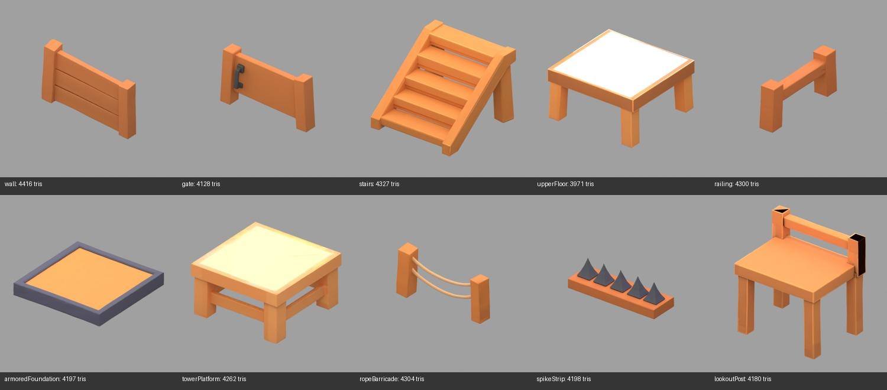

# Iteration 2 — Construction and lookout

Generation completed on 2026-09-17. All ten GLBs use Meshy T2 smart topology, requested 4,000 polygons and 2K textures, from the original concept PNGs. Total consumed: **150 credits**. The first stairs request failed with a server error and consumed zero credits; its successful retry stayed within the approved budget. Both task IDs are recorded in the manifest.

## Measured outputs

All exports are triangulated: polygon faces equal triangles. Each has one mesh object, one material and one embedded 2048 × 2048 base-color image. Dimensions in inspection.json use Blender XYZ (Z up), not SDK coordinates.

| Asset | Triangles / faces | GLB size (MiB) |
|---|---:|---:|
| [wall](../../../../assets/scene/items/expansion/wall.glb) | 4,416 | 1.56 |
| [gate](../../../../assets/scene/items/expansion/gate.glb) | 4,128 | 1.64 |
| [stairs](../../../../assets/scene/items/expansion/stairs.glb) | 4,327 | 1.84 |
| [upperFloor](../../../../assets/scene/items/expansion/upperFloor.glb) | 3,971 | 1.84 |
| [railing](../../../../assets/scene/items/expansion/railing.glb) | 4,300 | 1.35 |
| [armoredFoundation](../../../../assets/scene/items/expansion/armoredFoundation.glb) | 4,197 | 2.12 |
| [towerPlatform](../../../../assets/scene/items/expansion/towerPlatform.glb) | 4,262 | 2.21 |
| [ropeBarricade](../../../../assets/scene/items/expansion/ropeBarricade.glb) | 4,304 | 1.50 |
| [spikeStrip](../../../../assets/scene/items/expansion/spikeStrip.glb) | 4,198 | 2.10 |
| [lookoutPost](../../../../assets/scene/items/expansion/lookoutPost.glb) | 4,180 | 1.99 |

## Review and integration notes

- Blender import and preview rendering passed for all ten assets. Silhouettes are recognizable and broadly match the chunky reference style.
- `upperFloor` has an almost white top; `towerPlatform` has a pale yellow top in the rendered previews. These need appearance review before acceptance.
- `lookoutPost` has conspicuous black areas on its rear posts. Preserve this issue for cleanup/review; no extra paid texture pass was submitted.
- `spikeStrip` reconstructs more spikes than the reference. Treat this as an art difference, not a change to damage or collision rules.
- The gate exports as one mesh object including both posts and panel. Integration must address the existing whole-root rotation; this export does not supply a separate hinged panel.
- Stairs require an intentional visual/collider fit; the existing prototype step count differs from the concept. Grid fit, pivots, raised-deck height and walkability remain unverified.

**Runtime integration is complete.** Placed objects, ghosts, collision handling and the debug sandbox use these models. Runtime GLBs now contain fitted node transforms; the table and inspection above describe original exports preserved under `source-models/`. See [integration QA and mobile evidence](../../../qa/iteration-2/verification.md) for final dimensions, checks and remaining limits.

## Validation and records

- `python3 scripts/check_gltf_textures.py assets/scene/items/expansion --max-size 2048` passed for all 20 GLBs across iterations 1–2.
- Parsed each GLB: all images use embedded buffer views and all buffers are self-contained. Detached texture copies are archived in `source-textures/`, outside deployed assets.
- [Manifest](manifest.json): source paths, task IDs, settings, costs, outputs and measured geometry.
- [Inspection](inspection.json): Blender counts, texture dimensions, dimensions and file sizes.
- Individual `*-preview.png` files provide larger views. The previews are offline Blender renders, not Explorer screenshots.
