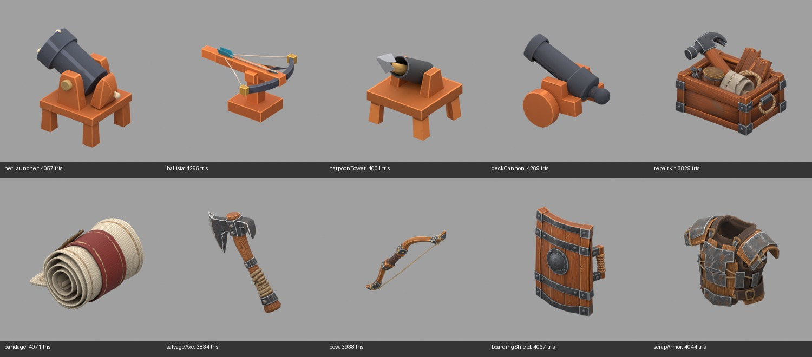

# Iteration 3 — Combat and held tools

Generated 2026-09-18 with user approval. **10 models, 150 Meshy credits consumed.** Both batches together consumed the approved 300 credits. Meshy T2 smart topology, target 4,000 polygons, textured at 2K, GLB output; input references are the original 1254 × 1254 concept PNGs.

## Measured outputs

Each GLB imports as one mesh object and one material, with one embedded 2048 × 2048 base-color image. All exports are triangulated, so polygon faces equal triangles. All have zero animations and zero skins. Inspection dimensions use Blender XYZ (Z up).

| Asset | Triangles / faces | GLB size (MiB) |
|---|---:|---:|
| [bandage](../../../../assets/scene/items/expansion/bandage.glb) | 4,071 | 3.70 |
| [netLauncher](../../../../assets/scene/items/expansion/netLauncher.glb) | 4,057 | 2.41 |
| [harpoonTower](../../../../assets/scene/items/expansion/harpoonTower.glb) | 4,001 | 2.08 |
| [scrapArmor](../../../../assets/scene/items/expansion/scrapArmor.glb) | 4,044 | 3.42 |
| [bow](../../../../assets/scene/items/expansion/bow.glb) | 3,938 | 3.89 |
| [boardingShield](../../../../assets/scene/items/expansion/boardingShield.glb) | 4,067 | 3.38 |
| [deckCannon](../../../../assets/scene/items/expansion/deckCannon.glb) | 4,269 | 1.75 |
| [repairKit](../../../../assets/scene/items/expansion/repairKit.glb) | 3,829 | 2.65 |
| [salvageAxe](../../../../assets/scene/items/expansion/salvageAxe.glb) | 3,834 | 3.45 |
| [ballista](../../../../assets/scene/items/expansion/ballista.glb) | 4,295 | 2.45 |

## Visual review and integration notes

- Weapon and equipment silhouettes are recognizable in the rendered view. Fine ropes, bowstring and kit contents need close-range and held-pose inspection during integration.
- Net launcher and deck cannon point upward more steeply than the source concepts. Establish the forward axis and gameplay aiming direction before wiring them into weapons.
- Weapons, strings and wheels are baked into single mesh objects; no separate moving parts, rig or animation clips were supplied.
- Held equipment has a more detailed surface style than the simple structure models, consistent with the provided source artwork.

**Game integration has not started for this batch.** Placement, held poses, collision, scale, directional alignment and desktop/mobile behavior remain unverified. No runtime code changed during generation.

## Validation and provenance

- Blender import, geometry/texture inspection and preview rendering completed for all ten assets.
- GLB JSON inspection verified all images use embedded buffer views and no buffers require external files. Detached texture copies are archived in `source-textures/` outside deployed assets.
- `python3 scripts/check_gltf_textures.py assets/scene/items/expansion --max-size 2048` passed for all 40 expansion models across iterations 1–4. Inspection separately confirmed each new image is exactly 2048 × 2048.
- [Manifest](manifest.json) records task IDs, source/output paths, settings, credits and measurements. [Inspection](inspection.json) records geometry counts, image sizes and native dimensions. Each asset also has a task record and a larger `*-preview.png` render.
- These are offline Blender previews, not Explorer screenshots. No paid remesh, retexture, rigging or animation was performed.
