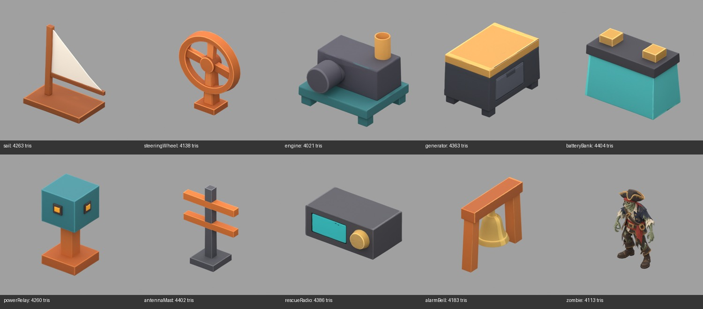

# Iteration 4 — Navigation, power and raids

Generated 2026-09-18 with user approval. **10 models, 150 Meshy credits consumed.** Both batches together consumed the approved 300 credits. Meshy T2 smart topology, target 4,000 polygons, textured at 2K, GLB output; input references are the original 1254 × 1254 concept PNGs.

## Measured outputs

Each GLB imports as one mesh object and one material, with one embedded 2048 × 2048 base-color image. All exports are triangulated, so polygon faces equal triangles. All have zero animations and zero skins. Inspection dimensions use Blender XYZ (Z up).

| Asset | Triangles / faces | GLB size (MiB) |
|---|---:|---:|
| [engine](../../../../assets/scene/items/expansion/engine.glb) | 4,021 | 1.66 |
| [zombie](../../../../assets/scene/items/expansion/zombie.glb) | 4,113 | 3.42 |
| [powerRelay](../../../../assets/scene/items/expansion/powerRelay.glb) | 4,260 | 1.84 |
| [alarmBell](../../../../assets/scene/items/expansion/alarmBell.glb) | 4,183 | 1.81 |
| [rescueRadio](../../../../assets/scene/items/expansion/rescueRadio.glb) | 4,386 | 1.99 |
| [steeringWheel](../../../../assets/scene/items/expansion/steeringWheel.glb) | 4,138 | 1.89 |
| [batteryBank](../../../../assets/scene/items/expansion/batteryBank.glb) | 4,404 | 2.08 |
| [sail](../../../../assets/scene/items/expansion/sail.glb) | 4,263 | 2.27 |
| [antennaMast](../../../../assets/scene/items/expansion/antennaMast.glb) | 4,402 | 2.10 |
| [generator](../../../../assets/scene/items/expansion/generator.glb) | 4,363 | 1.57 |

## Visual review and integration notes

- Navigation and power props retain their simple chunky forms and palette in the rendered view.
- Power relay includes an indicator on both visible faces, differing from the single visible indicator in the reference.
- The pirate zombie is a static, unrigged model in the reference stance. It has no skin or animation clips; walking/attack animation is not part of this generation batch.
- Sail cloth, bell, wheel and machinery are static parts of single mesh objects. Their facing, scale and gameplay motion require integration work.

**Game integration has not started for this batch.** Placement, held poses, collision, scale, directional alignment and desktop/mobile behavior remain unverified. No runtime code changed during generation.

## Validation and provenance

- Blender import, geometry/texture inspection and preview rendering completed for all ten assets.
- GLB JSON inspection verified all images use embedded buffer views and no buffers require external files. Detached texture copies are archived in `source-textures/` outside deployed assets.
- `python3 scripts/check_gltf_textures.py assets/scene/items/expansion --max-size 2048` passed for all 40 expansion models across iterations 1–4. Inspection separately confirmed each new image is exactly 2048 × 2048.
- [Manifest](manifest.json) records task IDs, source/output paths, settings, credits and measurements. [Inspection](inspection.json) records geometry counts, image sizes and native dimensions. Each asset also has a task record and a larger `*-preview.png` render.
- These are offline Blender previews, not Explorer screenshots. No paid remesh, retexture, rigging or animation was performed.

The first sail submission was rate-limited without a task ID. Submission resumed after iteration 3 completed; all ten accepted iteration 4 tasks succeeded. No duplicate task was submitted for any accepted request.
